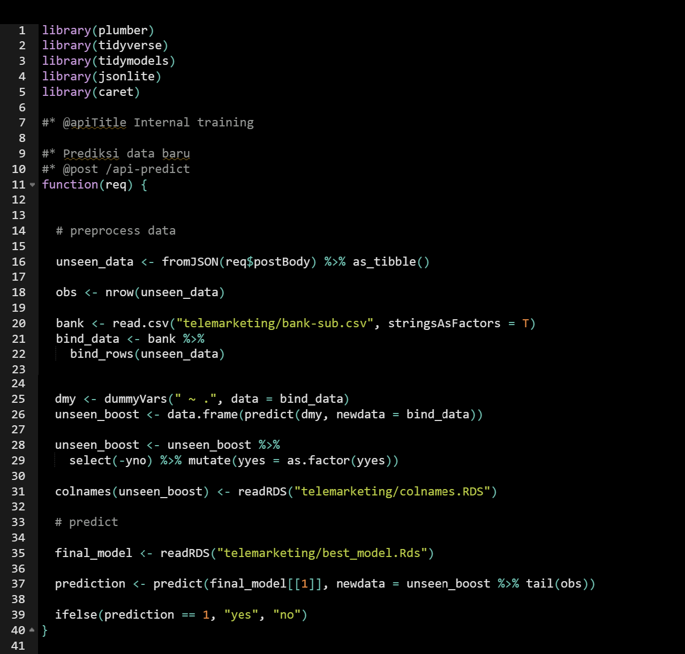

# In this Repo

Repository **plumber-example** bertujuan untuk memberikan demonstrasi singkat mengenai cara mempublikasikan model Machine Learning untuk dapat diakses oleh umum/kalangan tertentu yaitu dengan mempublikasinya pada server spesifik.

Untuk mempublikasikan suatu model dalam suatu sistem yang terintegrasi, model dan *code* yang diperlukan untuk menggunakan model tersebut dapat disusun menjadi sebuah **API**. 

API (application programming interface) berfungsi layaknya mediator/jembatan yang membantu user berinteraksi dengan proses di belakang layar/sistem. API membuat user dapat melakukan beragam **request** dan mendapatkan informasi yang dibutuhkan dari sistem tersebut, tanpa perlu mengetahui seluruh proses yang terjadi di belakang layar. Bila Anda belum familiar dengan API, ada baiknya untuk memahami concept sederhana [API](https://apimetrics.io/api-knowledge-base/apis-for-dummies/) terlebih dahulu.

Pada R, kita dapat menggunakan package **plumber** untuk membuat API.

# Plumber

> Plumber adalah R package yang memudahkan user untuk membangun web API hanya melalui serangkaian code dan comment tertentu.

Package Plumber telah menyediakan dokumentasi yang cukup lengkap terkait pengenalan plumber dan tutorial pembuatannya. Dokumentasi Plumber dapat diakses [disini](https://www.rplumber.io/articles/introduction.html).

# Example

Pada repositori ini tersedia demo plumber (plumber.R) untuk sebuah **model telemarketing** yang memprediksi apakah seorang customer akan mengikuti program telemarketing yang dipromosikan atau tidak. Dokumentasi pembuatan model serta file terkait model terdapat pada folder **telemarketing**. 

Berikut adalah script API yang telah dibuat:



Pada contoh di atas, dibuat **metode request** [POST](https://rapidapi.com/blog/api-glossary/post/) menggunakan comment `@post` dan dicantumkan pula [end-point](https://rapidapi.com/blog/api-glossary/endpoint/) nya yaitu `/api-predict`. Pada line berikutnya dapat kita masukkan model prediksi beserta code yang digunakan untuk menggunakan model tersebut.

**Cara mencoba demo plumber:**

1. Buka file `plumber.R`
2. **Run** plumber.R atau tekan `ctrl + enter`
3. Akan terbuka tampilan swagger (demo API) seperti yang tertera di bawah. Kita kemudian bisa mendapatkan URL API yang dibutuhkan.


a. Scroll ke bawah hingga tertera pilihan request. Pada contoh ini hanya terdapat request **POST** untuk *Prediksi data baru* dengan [end-point](https://rapidapi.com/blog/api-glossary/endpoint/) `api-predict`
  
b. Pilih (tekan tombol) POST dan akan terbuka panel seperti di bawah ini. Klik tombol **Try it out**.

  

c.  Kemudian cari informasi **URL** sebagai berikut:


4. Copy informasi url dan paste ke sintaks ke-2 di bawah.
5. Buka Rstudio di window baru dan masukkan 2 sintaks di bawah (Note: Jangan tutup RStudio sebelumnya untuk tetap running API)
6. Jalankan seluruh sintaks di bawah untuk simulasi request ke API.
   
```
bank_test <- structure(list(age = 35L, 
                            job = structure(5L, .Label = c("admin.", "blue-collar", "entrepreneur", 
                              "housemaid", "management", "retired", "self-employed", "services", 
                              "student", "technician", "unemployed", "unknown"), class = "factor"), 
                            marital = structure(2L, .Label = c("divorced", "married", "single"), class = "factor"), 
                            education = structure(3L, .Label = c("primary", "secondary", 
                              "tertiary", "unknown"), class = "factor"),
                            default = structure(1L, .Label = c("no", "yes"), class = "factor"), 
                            balance = 2957L, 
                            housing = structure(2L, .Label = c("no", "yes"), class = "factor"), 
                            loan = structure(2L, .Label = c("no", "yes"), class = "factor"), 
                            contact = structure(1L, .Label = c("cellular", "telephone", "unknown"), class = "factor"), 
                            day = 8L, month = structure(2L, .Label = c("apr", "aug", "dec", "feb", 
                              "jan", "jul", "jun", "mar", "may", "nov", "oct", "sep"), class = "factor"), 
                            duration = 733L, 
                            campaign = 3L, 
                            pdays = -1L, 
                            previous = 0L, 
                            poutcome = structure(4L, .Label = c("failure", "other", 
                              "success", "unknown"), class = "factor"), 
                            y = structure(2L, .Label = c("no", "yes"), class = "factor")), 
                       row.names = c(NA, -1L), 
                       class = c("data.table", "data.frame")
                       )
```

```
jbody <- toJSON(head(bank_test), pretty = T)

result <- httr::POST("http://127.0.0.1:9439/api-predict", body = jbody, httr::accept_json())

content(result)[[1]]
```

Akan diberikan hasil prediksi: "yes"

Pada tahapan di atas, kita sebagai user memberikan input berupa test dataset seperti yang tertera pada sintaks pertama. Kemudian mengubah test dataset tersebut ke format [JSON](https://www.w3schools.com/whatis/whatis_json.asp) yang dapat diterima oleh umum pada API. Kemudian kita melakukan request POST ke API dengan alamat HTTP yang tertera pada demo plumber.R yang telah kita buka sebelumnya. Pada tahap ini kita menggunakan fungsi `POST()` dari package [**httr**](https://httr.r-lib.org/) yang dikembangkan untuk memudahkan pengguna mengakses API secara umum. Selanjutnya, hasil yang kita terima dari API plumber.R (result) dapat ditampilkan.

Berikut adalah contoh response dari [postman](https://www.postman.com/):


**Additional Note:** Pada demo ini, API masih dijalankan pada server local Anda. Namun tidak menutup kemungkinan untuk menjalankannya pada server tertentu agar dapat dibuka oleh umum/kalangan yang dituju. Selamat bereksplorasi dan semoga bermanfaat!