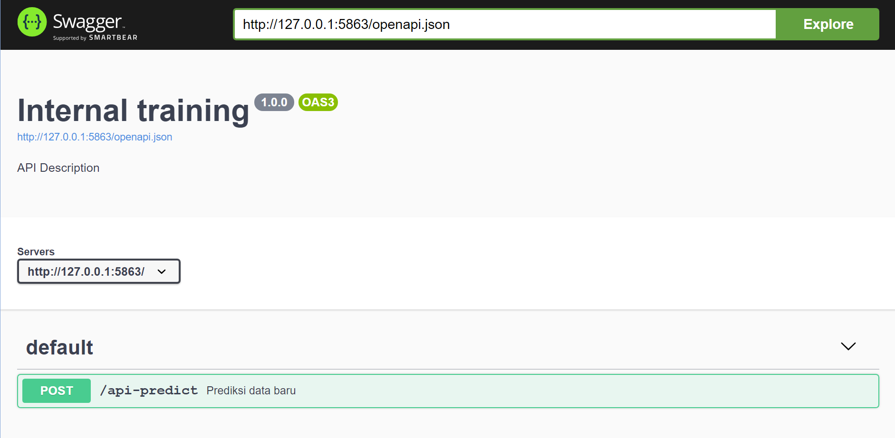
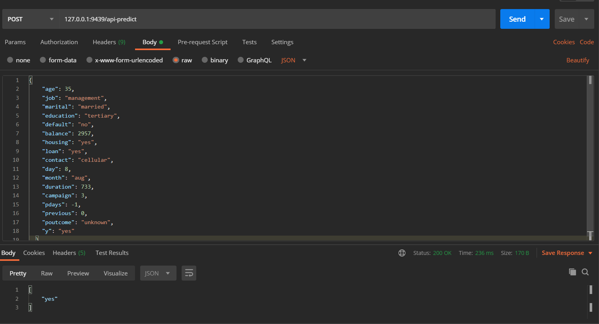

# Ide Dasar

Repository **plumber-example** bertujuan untuk memberikan demonstrasi singkat mengenai cara mempublikasikan model Machine Learning untuk diakses oleh umum/pada server spesifik.

Untuk mempublikasikan suatu model dalam suatu sistem yang terintegrasi, model dan code untuk tahapan penggunaan model tersebut perlu disusun menjadi sebuah API. Pada R, kita dapat menggunakan package **plumber** untuk membuat API.

# Plumber

Pada repositori ini tersedian demo plumber untuk 1 model telemarketing yang memprediksi apakah seorang customer akan mengikuti program telemarketing yang dipromosikan atau tidak. Dokumentasi pembuatan model serta file terkait model terdapat pada folder **telemarketing**.

Cara mencoba demo plumber:

1. Buka file `plumber.R`
2. **Run** plumber.R atau tekan `ctrl + enter`
3. Akan terbuka tampilan swagger (demo API)



1. Copy informasi url, paste ke sintaks ke-2 di bawah.
2. Buka Rstudio di window baru.
3. Jalankan seluruh sintaks di bawah
   
```
# input data

bank_test <- structure(list(age = 35L, job = structure(5L, .Label = c("admin.", 
"blue-collar", "entrepreneur", "housemaid", "management", "retired", 
"self-employed", "services", "student", "technician", "unemployed", 
"unknown"), class = "factor"), marital = structure(2L, .Label = c("divorced", 
"married", "single"), class = "factor"), education = structure(3L, .Label = c("primary", 
"secondary", "tertiary", "unknown"), class = "factor"), default = structure(1L, .Label = c("no", 
"yes"), class = "factor"), balance = 2957L, housing = structure(2L, .Label = c("no", 
"yes"), class = "factor"), loan = structure(2L, .Label = c("no", 
"yes"), class = "factor"), contact = structure(1L, .Label = c("cellular", 
"telephone", "unknown"), class = "factor"), day = 8L, month = structure(2L, .Label = c("apr", 
"aug", "dec", "feb", "jan", "jul", "jun", "mar", "may", "nov", 
"oct", "sep"), class = "factor"), duration = 733L, campaign = 3L, 
    pdays = -1L, previous = 0L, poutcome = structure(4L, .Label = c("failure", 
    "other", "success", "unknown"), class = "factor"), y = structure(2L, .Label = c("no", 
    "yes"), class = "factor")), row.names = c(NA, -1L), class = c("data.table", 
"data.frame"), .internal.selfref = <pointer: 0x000001770c681ef0>)
```

```
jbody <- toJSON(head(bank_test), pretty = T)

result <- httr::POST("http://127.0.0.1:9439/api-predict", body = jbody, httr::accept_json())

content(result)[[1]]
```

Akan diberikan hasil prediksi: "yes"

---

Contoh respone dari postman:

