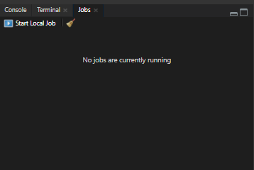
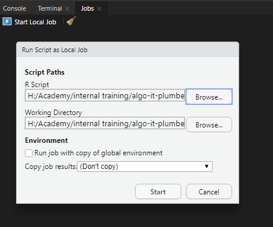
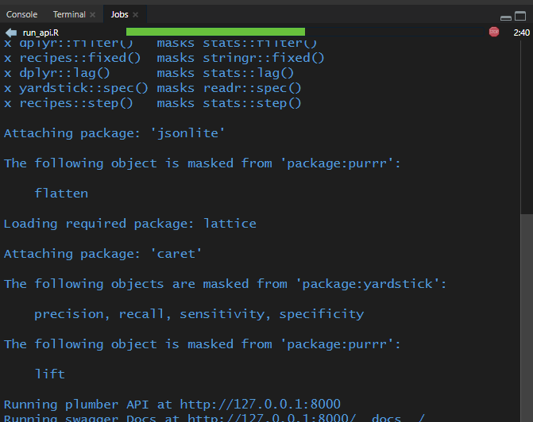
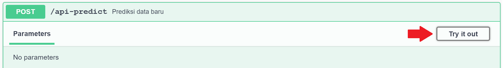
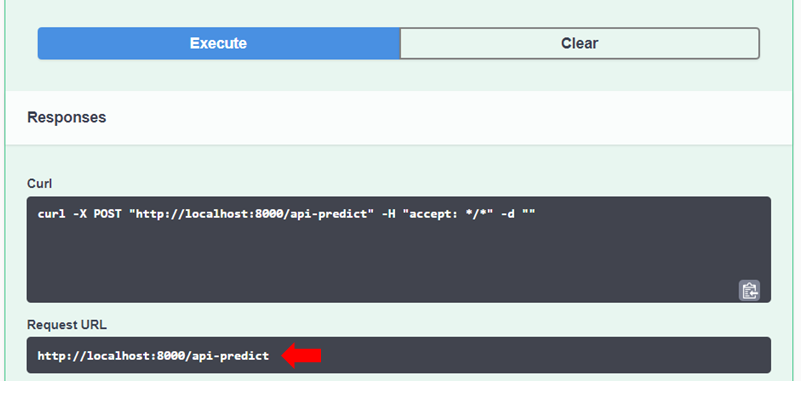

# In this Repo

Repository **plumber-example** bertujuan untuk memberikan demonstrasi singkat mengenai cara mempublikasikan model Machine Learning untuk dapat diakses oleh umum/kalangan tertentu yaitu dengan mempublikasinya pada server spesifik.

Untuk mempublikasikan suatu model dalam suatu sistem yang terintegrasi, model dan *code* yang diperlukan untuk menggunakan model tersebut dapat disusun menjadi sebuah **API**. 

API (application programming interface) berfungsi layaknya mediator/jembatan yang membantu user berinteraksi dengan proses di belakang layar/sistem. API membuat user dapat melakukan beragam **request** dan mendapatkan informasi yang dibutuhkan dari sistem tersebut, tanpa perlu mengetahui seluruh proses yang terjadi di belakang layar. Bila Anda belum familiar dengan API, ada baiknya untuk memahami concept sederhana [API](https://apimetrics.io/api-knowledge-base/apis-for-dummies/) terlebih dahulu.

Pada R, kita dapat menggunakan package **plumber** untuk membuat API.

# Plumber

> Plumber adalah R package yang memudahkan user untuk membangun web API hanya melalui serangkaian code dan comment tertentu.

Package Plumber telah menyediakan dokumentasi yang cukup lengkap terkait pengenalan plumber dan tutorial pembuatannya. Dokumentasi Plumber dapat diakses [disini](https://www.rplumber.io/articles/introduction.html).

# Example

Pada repositori ini tersedia demo plumber (plumber.R) untuk sebuah **model telemarketing** yang memprediksi apakah seorang customer akan mengikuti program telemarketing yang dipromosikan atau tidak. Dokumentasi pembuatan model serta file terkait model terdapat pada folder **telemarketing**. 

Berikut adalah script API yang telah dibuat:

```
library(plumber)
library(tidyverse)
library(tidymodels)
library(jsonlite)
library(caret)

#* @apiTitle Internal training

#* Prediksi data baru
#* @post /api-predict
function(req) {
  
  
  # preprocess data
  
  unseen_data <- fromJSON(req$postBody) %>% as_tibble()

  obs <- nrow(unseen_data)
  
  bank <- read.csv("telemarketing/bank-sub.csv", stringsAsFactors = T)
  bind_data <- bank %>% 
    bind_rows(unseen_data)
  
  
  dmy <- dummyVars(" ~ .", data = bind_data)
  unseen_boost <- data.frame(predict(dmy, newdata = bind_data))
  
  unseen_boost <- unseen_boost %>% 
    select(-yno) %>% mutate(yyes = as.factor(yyes))
  
  colnames(unseen_boost) <- readRDS("telemarketing/colnames.RDS")
  
  # predict
  
  final_model <- readRDS("telemarketing/best_model.Rds")
  
  prediction <- predict(final_model[[1]], newdata = unseen_boost %>% tail(obs))
  
  ifelse(prediction == 1, "yes", "no")
}


```

Pada contoh di atas, dibuat API untuk **metode _request_** [POST](https://rapidapi.com/blog/api-glossary/post/) menggunakan comment `@post`. Alasan menggunakan metode POST yaitu cenderung lebih aman karena data yang dikirim tidak terlihat di url. Selain itu dicantumkan pula [_end-point_](https://rapidapi.com/blog/api-glossary/endpoint/) untuk memperoleh _response_ hasil prediksi yang dinamakan `/api-predict`. 

Pada line berikutnya dapat kita masukkan model prediksi beserta code untuk menggunakan model tersebut.

Kemudian buat sebuah file script R baru yang lain dengan nama `run_api.R` yang isinya seperti berikut.

```
# run_api.R
library(plumber)
plumb(file = "plumber.R")$run(port = 8000)
```

Simpan kedua file tersebut dalam satu folder yang sama.

**Cara mencoba demo plumber:**

1. Pergi ke panel *console*, cari menu **Job** kemudian pilih _**Start Local Job**_

<center> 



</center>

2. Sesuaikan *working directory* dan pastikan file yang terpilih pada menu R scipt adalah `run_api.R`.

<center> 



</center>

Selanjutnya klik Start. REST API plumber berhasil berjalan ketika tampilan pada tab Jobs seperti berikut ini.

<center> 



</center>


3. Akan terbuka tampilan swagger (demo API) seperti yang tertera di bawah. Jika tidak muncul, anda dapat membuka browser dan masukkan alamat berikut: [http://localhost:8000/__docs__/](http://127.0.0.1:8000/__docs__/)

<center> 


</center>

* Scroll ke bawah hingga tertera pilihan request. Pada contoh ini hanya terdapat request **POST** untuk *Prediksi data baru* dengan [end-point](https://rapidapi.com/blog/api-glossary/endpoint/) `api-predict`
  
* Pilih tombol POST dan akan terbuka panel seperti di bawah ini. Klik tombol **Try it out**.

<center> 



</center>

* Kemudian cari informasi **URL** sebagai berikut:

<center> 



</center>

Kita dapat melakukan uji coba API pada browser, R, atau aplikasi lain seperti *Postman*. Jika API sudah berjalan dengan benar, maka akan muncul *response* status **yes** atau **no** tergantung dengan hasil prediksi model. Berikut adalah cara mencoba API dengan R:

1. Buat file R script baru atau R markdown.
2. Jalankan seluruh sintaks di bawah untuk simulasi request ke API. 


```
library(tidyverse)
library(httr)
library(jsonlite)


# membuat data uji coba
bank_test <- structure(list(age = 35L, 
                            job = structure(5L, .Label = c("admin.", "blue-collar", "entrepreneur", 
                              "housemaid", "management", "retired", "self-employed", "services", 
                              "student", "technician", "unemployed", "unknown"), class = "factor"), 
                            marital = structure(2L, .Label = c("divorced", "married", "single"), class = "factor"), 
                            education = structure(3L, .Label = c("primary", "secondary", 
                              "tertiary", "unknown"), class = "factor"),
                            default = structure(1L, .Label = c("no", "yes"), class = "factor"), 
                            balance = 2957L, 
                            housing = structure(2L, .Label = c("no", "yes"), class = "factor"), 
                            loan = structure(2L, .Label = c("no", "yes"), class = "factor"), 
                            contact = structure(1L, .Label = c("cellular", "telephone", "unknown"), class = "factor"), 
                            day = 8L, month = structure(2L, .Label = c("apr", "aug", "dec", "feb", 
                              "jan", "jul", "jun", "mar", "may", "nov", "oct", "sep"), class = "factor"), 
                            duration = 733L, 
                            campaign = 3L, 
                            pdays = -1L, 
                            previous = 0L, 
                            poutcome = structure(4L, .Label = c("failure", "other", 
                              "success", "unknown"), class = "factor"), 
                            y = structure(2L, .Label = c("no", "yes"), class = "factor")), 
                       row.names = c(NA, -1L), 
                       class = c("data.table", "data.frame")
                       )
```

```
# mengubah data frame menjadi input json
jbody <- toJSON(head(bank_test), pretty = T)

# proses request ke API
result <- httr::POST("http://127.0.0.1:8000/api-predict",
 body = jbody, 
 httr::accept_json())

content(result)[[1]]
```

```
"yes"
```

Akan diberikan hasil prediksi: **"yes"**

Pada tahapan di atas, kita sebagai user memberikan input berupa **test dataset** (bank_test) seperti yang tertera pada sintaks pertama. Kemudian mengubah test dataset tersebut ke format [JSON](https://www.w3schools.com/whatis/whatis_json.asp) yang dapat diterima oleh API. Kemudian kita melakukan request POST ke API (URL) yang telah kita ambil sebelumnya. Pada tahap ini kita menggunakan fungsi `POST()` dari package [**httr**](https://httr.r-lib.org/) yang dikembangkan untuk memudahkan user mengakses API secara umum. Selanjutnya, hasil yang kita terima dari API (result) dapat ditampilkan.

Berikut adalah contoh response dari [postman](https://www.postman.com/):


**Additional Note:** Pada demo ini, API masih dijalankan pada server local Anda. Namun tidak menutup kemungkinan untuk menjalankannya pada server tertentu agar dapat dibuka oleh umum/kalangan yang dituju. Selamat bereksplorasi dan semoga bermanfaat!